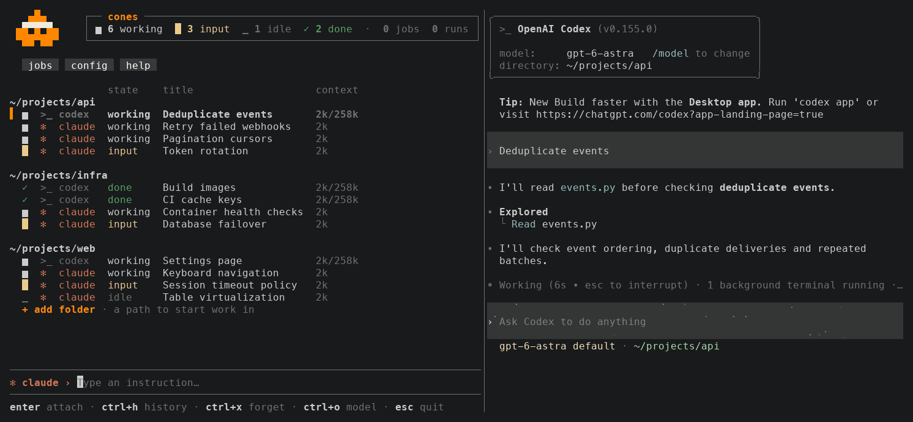

<p align="center">
  
</p>

**A terminal workspace for coding agents.** Peek into sessions, return to past work, and start work in another project without leaving the dashboard.

cones brings Claude Code, Codex, pi and OpenCode into one workspace while keeping their native terminal interfaces. Your conversations stay with each harness, so you can use its CLI directly whenever you prefer.

Experimental terminal launchers also support Gemini CLI, Cursor Agent, Copilot CLI, Amp, Droid and Kimi. These offer launch, process discovery and return to an owned viewer; native conversation history, state and usage reporting are not integrated.

<p align="center">
  <a href="https://github.com/YuvalSarel1/cones/actions/workflows/ci.yml"></a>
  
  <a href="LICENSE-MIT"></a>
</p>

[Install](#install) · [Quick start](#quick-start) · [Documentation](#documentation)

<p align="center"><a href="assets/tui.gif"></a><br><sub>Recorded with native CLIs in sample projects. <a href="assets/tui.svg">Still image</a>.</sub></p>

## Work from one place

| | In cones |
| --- | --- |
| Live sessions | See running agents grouped by project, including sessions started outside cones. |
| Attention | Find input requests and completed work you have not reviewed. |
| Previews | Peek into supported live sessions and open their native interface when you want to respond. |
| Persistent terminals | Keep shells and hosted agents running when closing the dashboard. |
| History | Browse past conversations, read previews and resume a session. |
| Projects | Add an existing folder and start an agent there from the dashboard. |
| Settings | Adjust the layout, visible columns and model defaults in place. |
| Scheduled work | Create recurring Claude Code jobs and review their output and cost. |

Each harness keeps its own tools and permissions. Available previews and controls follow its [native capabilities](docs/harness.md#native-actions).

## Models, harnesses and interfaces

| Tool | Choice it preserves |
| --- | --- |
| [OpenCode](https://opencode.ai/docs/providers/) / [pi](https://pi.dev) | Choose your model and provider while keeping one harness. |
| [T3 Code](https://github.com/pingdotgg/t3code) | Choose your harness while keeping T3's common interface. |
| [Agent Deck](https://github.com/asheshgoplani/agent-deck) | Keep native agent CLIs while managing tmux sessions and Git worktrees. |
| [Superset](https://github.com/superset-sh/superset) | Keep native agent CLIs in a desktop workspace with Git worktrees. |
| cones | Keep native terminal interfaces in a shared workspace, including supported sessions started elsewhere. |

## Install

Requires macOS. Install and configure the harnesses you want to use:

| Harness | Requirement |
| --- | --- |
| Claude Code | 2.1 or later, with background sessions (`--bg` and `attach`). |
| Codex | 0.154 or later. |
| pi | `pi` available in your terminal. |
| OpenCode | Native CLI with SQLite session storage. See [harness support](docs/harness.md#opencode). |
| Experimental launchers | Install and authenticate `gemini`, `cursor-agent`, `copilot`, `amp`, `droid` or `kimi`. See [supported controls and limits](docs/harness.md#additional-terminal-harnesses). |

Install cones with Homebrew:

```sh
brew tap YuvalSarel1/cones https://github.com/YuvalSarel1/cones
brew trust YuvalSarel1/cones
brew install cones
```

Or build it with Cargo:

```sh
cargo install --git https://github.com/YuvalSarel1/cones
```

From a checkout of this repository, `cargo install --path .` does the same.

## Quick start

Open the workspace. Existing sessions appear automatically; no configuration file is needed.

```sh
cones
```

To start work in a project:

1. Select `+ add folder` at the bottom of the session list and enter an existing project directory.
2. Use `Shift+Tab` to choose a harness.
3. Type an instruction and press `Enter`.

Open a session with `Enter`; `Ctrl+Z` returns to the list. Press `Ctrl+H` to browse history, select a conversation to preview it, and press `Enter` to resume.

`●` marks an unread completion. Use `Ctrl+F` with `:attention` to find input requests and unread work. Quitting cones keeps owned terminals running; reopen the dashboard and press `Enter` to reconnect. `Ctrl+X` twice explicitly stops a terminal.

Press `Ctrl+Y` to [fork a supported conversation](docs/dashboard.md#fork-a-conversation). The new session appears beneath its parent with aligned columns. It uses the same folder, so file edits are shared.

The `config` menu lets you change the layout, columns and shared defaults. Press `Ctrl+O` to change the selected harness's model and launch settings. To open a shell in the selected project, choose `terminal` with `Shift+Tab` and press `Enter`.

See the [dashboard guide](docs/dashboard.md) for the full controls.

### Schedule work

Open `jobs` in the menu, choose `new job`, and enter the task, folder and schedule. Saving installs the schedule. Select a job and press `Enter` to run it immediately.

Scheduled jobs currently use Claude Code. A job is the agent you run by hand, on a schedule: your settings, your MCP servers, no permission prompts, and a timeout. For file-based setup, start with [jobs.example.yaml](jobs.example.yaml) and the [configuration guide](docs/jobs.md).

### Run a task from the shell

```sh
cones run --prompt "Read this repo and summarize its TODOs."
```

This runs a supervised Claude Code task in the current directory. See [one-off tasks](docs/cli.md#one-off-tasks) for policy selection.

## Documentation

| Guide | Contents |
| --- | --- |
| [Dashboard](docs/dashboard.md) | Controls and interactions, in screen order. |
| [Configuration and runs](docs/jobs.md) | All `jobs.yaml` fields, scheduling and run lifecycle. |
| [Commands](docs/cli.md) | CLI flags, one-off tasks and diagnostics. |
| [Harness support](docs/harness.md) | Native sources, reports and capabilities. |
| [Harness definitions](docs/harness-definitions.md) | The built-in integration schema. |
| [Key bindings](docs/bindings.md) | Shortcut states, actions and the embedded YAML format. |
| [Testing](docs/testing.md) | Shared check queue, focused checks and native fixtures. |
