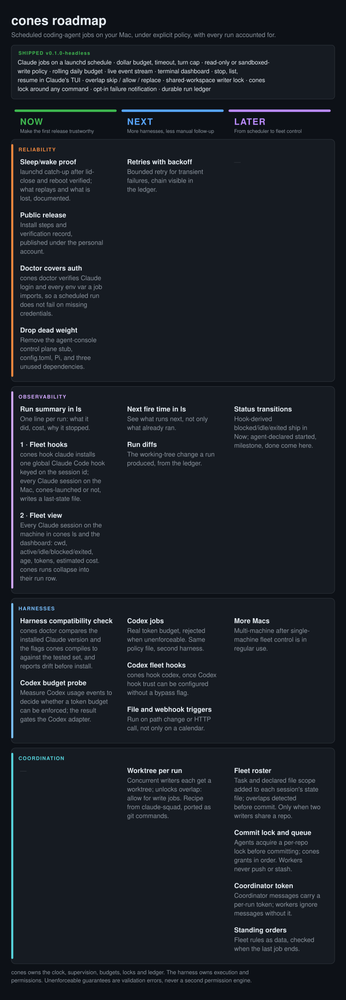

# cones

Scheduled coding-agent jobs on a local Mac. Each job runs under an explicit policy the harness enforces natively, and every run lands in a durable ledger.

`v0.1.0-headless` runs Claude Code jobs on a launchd schedule, streams their output live, and resumes finished sessions in Claude's own TUI. Codex and Pi are recognized but not yet executed.

## Try it

Requires Rust and Claude Code.

```sh
cargo install --path .
cp jobs.example.yaml jobs.yaml   # gitignored
cones validate
cones doctor
cones run readme-check
cones ls
cones logs RUN_UUID --follow
```

Happy with the schedule? `cones install --dry-run` prints the launchd plists, `cones install` writes them, `cones uninstall` removes them and keeps history. Installs are idempotent.

## A job

```yaml
version: 1
defaults:
  timeout_min: 30
  budget_usd: 2.00
  daily_budget_usd: 10.00
  write: false
jobs:
  - name: nightly-triage
    schedule: "0 2 * * *"          # five-field cron, compiled to launchd
    harness: claude
    cwd: ~/src/myrepo
    prompt: "Read the TODOs and draft TRIAGE.md."
    write: true                    # false removes Edit, Write and Bash
    tools: ["Read", "Grep", "Glob", "Edit", "Write"]
    model: sonnet
    max_turns: 5
    overlap: skip                  # skip | allow | replace
    # env: ["ANTHROPIC_API_KEY"]   # only named variables reach the job
```

What the job gets: a pinned session ID, print mode, a native dollar budget, a runner timeout, no prompts, no user or project settings, no MCP servers, and a strict sandbox when Bash is enabled. `daily_budget_usd` is a rolling 24-hour reservation. Anything the harness cannot enforce natively fails `cones validate`; there is no best-effort fallback.

`overlap` decides what happens when a job is still running at its next tick. Writers on the same directory are serialized across jobs regardless.

## Runs

```sh
cones ls --status failed         # tab-separated, fzf-friendly; --json for records
cones logs RUN_UUID --follow     # Ctrl+C detaches, the run keeps going
cones stop RUN_UUID
cones attach RUN_UUID            # resume the finished session in Claude's TUI
```

A run is `ok`, `failed`, `timeout`, `skipped` or `crashed`, with a reason such as `permission`, `budget`, `overlap` or `workspace`. On timeout, stop or permission denial the whole process group is terminated. State lives in `~/.cones` (`--state-dir` to isolate): the `runs.jsonl` ledger, per-run events and stderr, archived transcripts, launchd logs.

launchd runs after login, coalesces ticks missed during sleep, and does not wake the Mac or replay time spent powered off.

## Roadmap

<p align="center"></p>

## Development

```sh
cargo fmt --check && cargo clippy --all-targets -- -D warnings && cargo test --all-targets
```

Tests use fake harness processes and spend no model tokens. Rules for agents working here are in [AGENTS.md](AGENTS.md).

Licensed under either Apache-2.0 or MIT, at your option.
