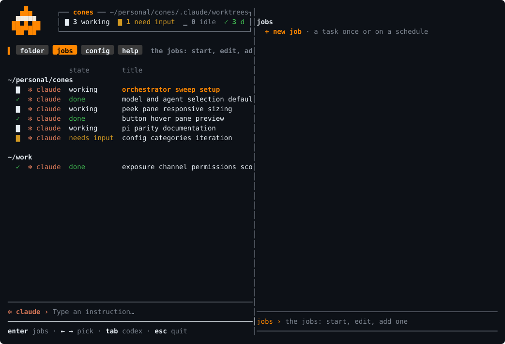

<p align="center">
  
</p>

**A dashboard for your coding agents.** See what is running, move between sessions, and start, stop or schedule work.

The goal is one place to work across harnesses. **Today: Claude Code on macOS, with Codex sessions seen beside it.**

<p align="center">
  
  
  
  <a href="LICENSE-MIT"></a>
</p>

<p align="center"><a href="assets/tui.svg"></a></p>

## What you can do today

- **See what is running.** Every Claude Code session on the Mac, including ones cones did not start: directory, state, recent activity, token usage and last reply, as Claude reports them.
- **Move between agents.** Preview a session, attach to it, then return to the dashboard. Follow live output from headless runs.
- **Control when work happens.** Start tasks, stop sessions and schedule jobs with launchd. Set budgets, timeouts, tool permissions and overlap rules for the jobs cones runs.
- **Bring in a coordinator.** Start the bundled orchestrator in a folder to help agents coordinate changes and share findings. It runs as an ordinary, visible agent.

## Get started

Requires macOS, Rust and Claude Code 2.1 or later, logged in.

```sh
cargo install --git https://github.com/YuvalSarel1/cones
cones tui
```

`Enter` opens a session or follows a running job's output. `Ctrl+Z` comes back from an opened session, which keeps running. A harness that cannot be left and re-entered is not opened from here, and the dashboard says why. `n` starts a task in the current directory; `x` twice stops one.

```sh
cones run --prompt "Read this repo and summarize its TODOs."
cones coordinator start
```

One-off tasks use the first job's policy, or read-only defaults without a jobs file. To schedule work, adapt [jobs.example.yaml](jobs.example.yaml) into `jobs.yaml`, then run `cones validate`, `cones run <job-name>` and `cones install`. `cones doctor` says what would break a scheduled run.

## How cones fits

cones reads the session state and transcripts the harness writes; a metric the harness does not report stays absent. Harnesses own execution and permissions. cones adds scheduling, supervision, budgets and run records, with launchd doing the scheduling and no cones daemon between runs.

Job policies cover the headless runs cones launches. Sessions started elsewhere, and the coordinator, keep their native permissions. Keeping agents out of each other's changes is the coordinator's business, not cones logic; two jobs that write one directory both run.

## Roadmap

Now: the v0.1.0 tag and the public release. Next: `overlap: continue`, lifecycle hooks for jobs cones launches, next fire time in `ls`, run diffs, sleep and wake proof. [Source](assets/roadmap.py).

<p align="center"><a href="assets/roadmap.svg"></a></p>

[Job configuration](docs/jobs.md) · [What a run does](docs/runs.md) · [Sessions and dashboard](docs/fleet.md) · [Kinds of agent](docs/kinds.md) · [What cones needs from a harness](docs/harness.md) · [Commands](docs/cli.md)
