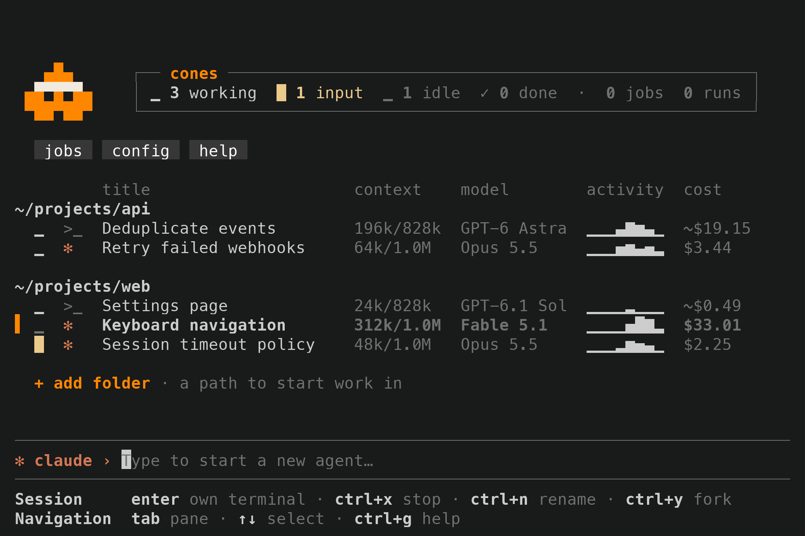
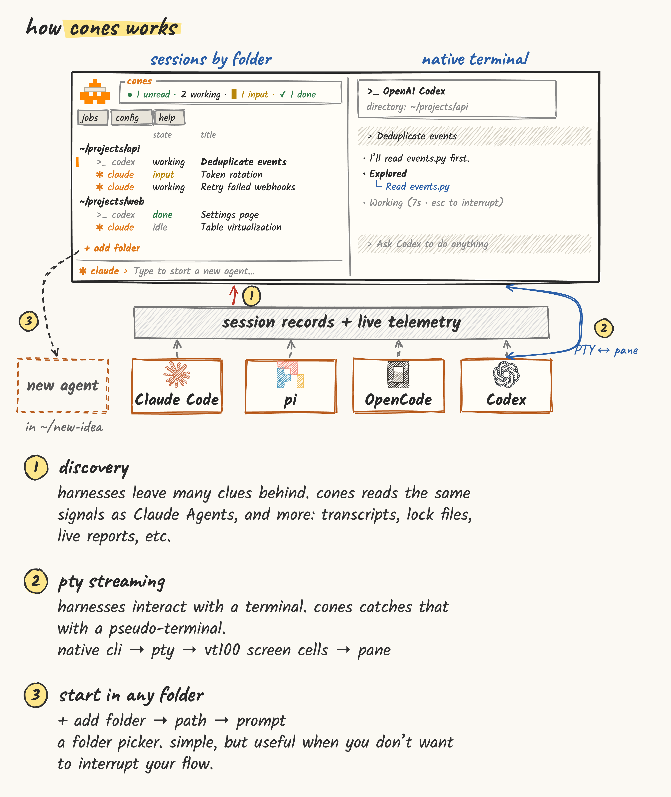

<p align="center">
  
</p>

**A terminal workspace for coding agents.** Browse sessions and history, peek into running work, and start agents across projects. Claude Code, Codex, pi and OpenCode keep their native terminal interfaces.

<p align="center"><a href="assets/tui.gif"></a><br><sub>Recorded with native CLIs in sample projects. <a href="assets/tui.svg">Still image</a>.</sub></p>

## Install

Requires macOS and a [configured harness](docs/harness.md).

```sh
brew tap YuvalSarel1/cones https://github.com/YuvalSarel1/cones
brew trust YuvalSarel1/cones
brew install cones
```

Homebrew builds cones from source and refuses when Xcode is older than macOS. Update Xcode, or use Cargo: `cargo install --git https://github.com/YuvalSarel1/cones`.

## Quick start

```sh
cones
```

Existing sessions appear automatically. `Enter` opens one; `Ctrl+Z` returns to the list.

To start work, select `+ add folder` and enter a project directory. Choose a harness with `Shift+Tab`, type an instruction, and press `Enter`.

<p align="center"><a href="assets/architecture.png"></a></p>

[Dashboard](docs/dashboard.md) · [Commands](docs/cli.md) · [Scheduled jobs](docs/jobs.md) · [Harness support](docs/harness.md) · [Architecture](docs/architecture.md) · [Comparisons](docs/comparisons/README.md)
