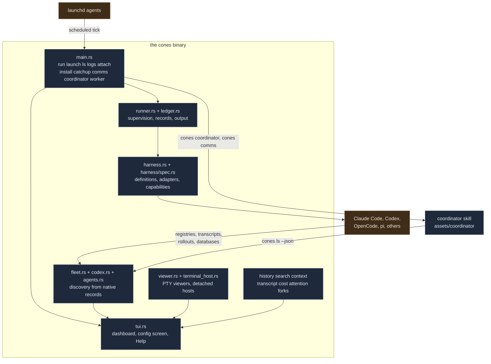
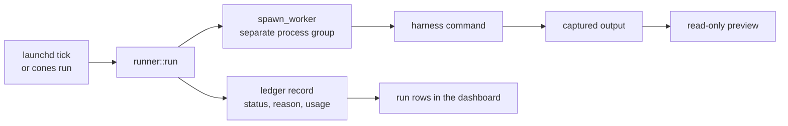
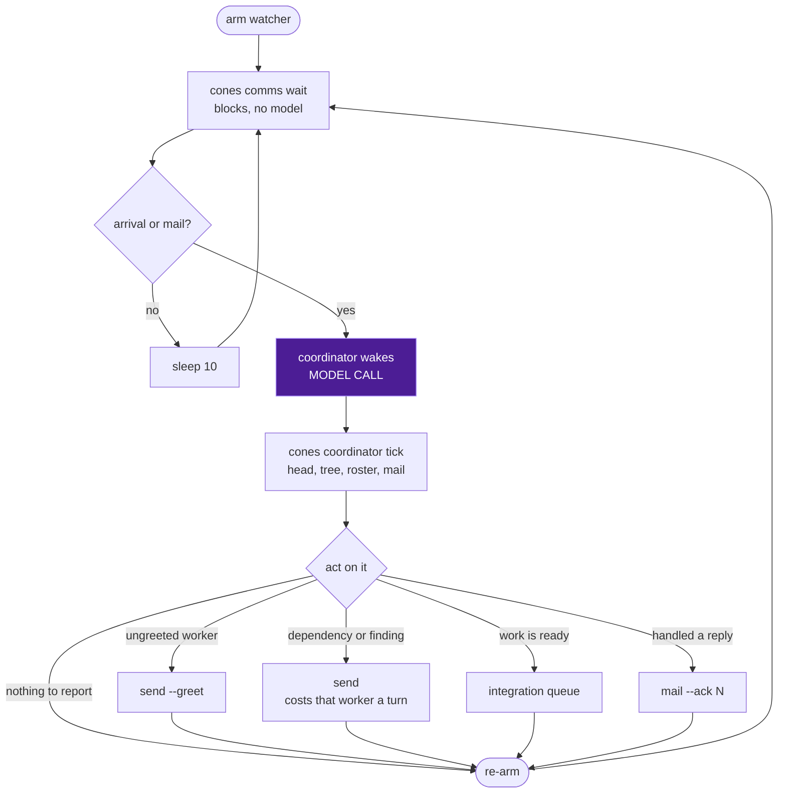
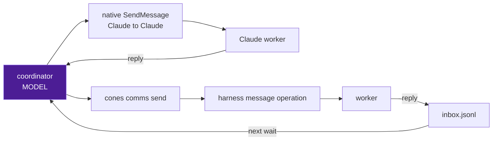

# Architecture

cones is one binary. It schedules and supervises agent runs, keeps the ledger those runs write,
and draws a dashboard over every agent session on the machine. It never executes an agent's tools
and never decides an agent's permissions: that belongs to the harness, and the boundary is the
single most load-bearing rule in the codebase.

This document is the map. Per-area detail lives in [dashboard.md](dashboard.md),
[jobs.md](jobs.md), [harness.md](harness.md) and [harness-definitions.md](harness-definitions.md).

## The boundary

| cones owns | The harness owns |
| --- | --- |
| Scheduling and catch-up | Running the agent |
| Supervision and `timeout_min` | Tool calls and permissions |
| The ledger and captured output | Session identity and state |
| Discovery, drawing, navigation | Stopping, removing, renaming |

`timeout_min` is the only limit cones puts on a run. cones never intercepts a harness tool call
and never adds a second permission engine. A policy the harness cannot enforce natively is a
validation error rather than a best effort, because a guarantee cones cannot keep is worse than
a refusal the user can see.

Reported facts are read, never estimated. State, context window and usage come from what the
harness itself reports; a value it never reported stays absent rather than inferred.

## Components



Everything in the dark box is this binary. The harness and launchd are outside it, and the arrows
crossing that line are the whole integration surface.

## Runs and the ledger

A job is the agent you would run by hand, on a schedule: your settings, your MCP servers, no
permission prompts, and a timeout. `jobs.yaml` holds them, `cones install` writes the LaunchAgents,
and a tick runs `cones run`. `cones catchup` covers ticks that passed while the Mac was off.



The worker runs in its own process group so a supervised run outlives the process that started it
and can be stopped as a unit. The ledger keeps the record, the captured output and the reason,
which is what a run row shows long after its agent is gone. A resumed run keeps its place in the
run list: the session the harness reports for it belongs to that row, not to a new agent.

## Harness definitions

`assets/harnesses/*.yaml` declares each harness: where it keeps sessions, what it reports, and
which operations it supports. `harness/spec.rs` validates a definition and compiles the values its
consumers use, so unknown fields, inconsistent capabilities and invalid command operands are
errors rather than surprises at runtime.

An operation needs a native adapter behind it. Declaring `rename: true` means the harness has a
native rename cones can hand off to; only the compiled Claude execution adapter can authorize a
supervised run. Unverified support is named `unknown` rather than assumed.

## Discovery

The fleet is built from records the harnesses own: Claude's session registry and transcripts,
Codex's processes, writer locks, thread database and rollouts, OpenCode's SQLite storage. cones
reads them and reports one state per session. It starts no client to ask.

A process is not a conversation. A harness launched into a terminal with no archive adapter gives
a row with a folder and a title, and its identity, state and accounting stay absent rather than
guessed. A Codex agent is its thread rather than its pid, so a client restart is not an exit.

## Observation cost

A refresh is one observation pass. It runs on its own thread, and everything it acquires is
acquired once and shared with every reader in that pass: the whole process table is read once
however many harnesses are offered, and a native index is read once however many consumers of
that home ask for it. `observe.rs` holds the accounting, which is thread-local for that reason.

What a pass keeps beyond itself needs a source and a rule that says when it is stale. A Codex
index is reread when its home's index file, state database or write-ahead log changes. A
folder's repository layout is reread when the folder's own `.git` entry changes or a minute
passes, and its branch is read from `HEAD` every time rather than asked for. Liveness and
control never reuse an observation: a pid is checked against the kernel before anything signals
it. An unreadable source is an error, never an empty one, and the failure is shared across the
pass so four adapters are not four retries.

Native databases are read in process, read-only, one statement at a time; no read creates,
migrates or writes one, and none holds a transaction open across a refresh. The accounting is
diagnostic: it counts what cones launched to observe, it never wraps a harness's execution, and
it imposes no limit on a run. `--debug` reports it in `timing.summary` as `processes` and a
per-operation `observation` block, so a dashboard's recurring cost is readable from its own log.

## The dashboard

`tui.rs` draws sessions, runs, jobs and history as rows, with a preview pane beside them. It is
one file because its `App` holds the shared state every screen reads; a split into per-screen
modules was tried and folded back.

Viewers are PTY-backed and rendered through vt100 into the pane, so viewer output never reaches
the real terminal directly. A live pane is the native client, not an emulation of one, which is
why controls in a pane follow the harness's own capabilities. Historical rows get read-only
transcript previews instead. `terminal_host.rs` keeps one detached PTY owner per interactive
terminal, so work survives the dashboard closing; it runs no agent tools and makes no permission
decisions.

The read-only side of the dashboard is deliberately large: history, search, context inspection,
cost provenance, attention markers and fork parentage are all observers over native records.
Search keeps text and cached passage embeddings in SQLite and runs inference on a separate worker,
so neither a draw nor a test starts a model.

## The coordinator

The coordinator is one agent session running the `start-coordinator` skill, which ships in this
repository under `assets/coordinator` and is compiled into the binary with `include_str!`.
`cones coordinator start` writes the plugin out and starts a background Claude session for a folder.

The skill is prose. Everything it needs a program for is in `src/coordinator.rs`: `claim` and
`tick` under `cones coordinator`, and `send`, `mail` and `wait` under `cones comms`, which
`cones coordinator` still spells too because a session started before the rename has the older
skill loaded. An agent that dispatched its own workers uses `cones comms` without ever starting a
coordinator; the role and the plumbing are separate. That split is the point.
Judgment about overlaps, findings and integration belongs to the model reading the skill; the
claim on a folder, the wake gate, the mail positions and delivery are mechanism, and mechanism
in a prompt is a second implementation nobody tests.

It schedules nothing and executes nothing. It reads who is working in a folder, carries facts
between those workers, and lands their finished changes.

The plumbing is harness-neutral. State lives under the state directory rather than a harness's
home, identity comes from the roster rather than one harness's registry, and delivery comes from
the harness definition. So the role is not Claude's to hold, even though today's launcher starts
a Claude session to fill it.

### Where the model calls are

Three places, and only three.

1. The coordinator wakes. One call per wake, whatever caused it.
2. A worker receives a message. A note costs the recipient a turn, so a message it did not need
   is a real cost charged to someone else's budget.
3. A worker does its own work, which is the point and not the coordinator's concern.

Neither command group makes one. This is why the wake gate is the most load-bearing piece of the
design: a gate that fires when nothing happened turns a ten second sleep into a model call every
ten seconds.

### The wake loop



`wait` returns for exactly two things: a session on the folder's roster that it has not shown
before, and a line appended to the folder's inbox. A departure, a state moving between active,
idle and blocked, and an edit to the tree are read from `tick` when the coordinator is already
awake, because waking to learn that somebody else is still working spends a call for nothing.
The rule lives in one function, so there is no loop condition in the prompt for a coordinator to
widen. `wait` records what it returned before returning it, so a change nobody woke for cannot
come back as news, and one pending batch of mail wakes the coordinator once rather than on every
pass. The first arm records the roster as it stands and keeps waiting: everything already there
was read by the tick that came before it, and is not an arrival.

Mail is the exception to that first arm. A reply that lands between the read and the arm is
unacknowledged, which is the record of nobody having acted on it, so the watcher returns it
rather than snapshotting over it. Otherwise a dispatcher blocks on a worker that already answered.

Repeated `--id` narrows the watch to named workers, which is the shape an agent that dispatched
its own set needs. Arrivals stop counting and the wake reasons become a native input request, a
native failure and a worker leaving the roster. Each is announced once and again only after the
worker has been out of that condition, so a worker still waiting for input does not wake the
dispatcher every ten seconds. None of them is completion: they say a worker stopped moving on its
own, and the assignment's result is the worker's own report. Mail wakes a narrowed watch too.
`--timeout` is the caller's recovery boundary and limits nothing on the worker's side; cones never
reads a quiet transcript as a dead agent.

A `claim` counts mail that predates it as handled, so a coordinator arriving in a folder with
history does not treat that history as a backlog it was asked to answer. Reading mail never
moves the acknowledged position; only `mail --ack N` does. That is what lets a replaced
coordinator see a reply the one before it read and never acted on, and a claim lowers the
watcher's position back to the acknowledged one so the replacement's first wait returns it.

A folder has one consumer, because the acknowledged position is a single cursor and the watcher
keeps a single position. `mail` and `wait` are refused while a different live agent holds the
claim, and a second `wait` is refused while one is armed, which a lease in `watcher.json` decides.
`send` stays unrestricted: anyone may write into a folder, and only reading out of one competes.

The tests are `the_coordinator_wakes_for_an_arrival_and_for_mail_and_for_nothing_else`,
`mail_stays_pending_until_it_is_acknowledged`, `a_reply_that_lands_before_the_first_wait_still_wakes_it`,
`a_claim_puts_unacknowledged_mail_back_in_front_of_the_watcher`,
`a_folder_rejects_a_second_inbox_consumer_and_a_second_watcher` and
`a_watch_on_named_workers_reports_each_stall_once_and_is_not_completion` in `tests/core.rs`.

### Roster and messaging

The roster is the same read `cones ls --dir --json` prints, covering the folder and the worktrees
under it. cones decides who is a worker: it drops unclaimed spares, resolves a Codex thread to
its client, ignores viewer and daemon processes, and turns each harness's own report into one
state. The coordinator does not re-derive any of that, because a second implementation of
discovery drifts from the first and the disagreement surfaces as a worker that exists in one
view and not the other.

Delivery is a harness operation, declared beside `attach` and `fork`:

```yaml
  message:
    args: [--remote, "{remote}", queue, --thread, "{id}", --message, "{text}"]
```

A harness with no `message` block cannot be written to, and `send` says so rather than
approximating it. Typing into a session's terminal would put the coordinator's words in the
owner's own input line, which is not a message from a peer.



A Claude reply arrives in the coordinator's conversation and costs it a turn immediately. A
worker with no native way back appends one JSON line to the folder's inbox, which costs nothing
until the next wake; `send` tells it the path and the shape. Delivery is not reading: a message
can reach a session whose agent never answers, which is why the greeting asks for an
acknowledgement. Without one, a worker that read the greeting and a worker that never received
it look identical.

A greeting introduces the sender to the session once and is recorded, so repeating one is a
no-op rather than a second interruption, and finishing a task cannot suppress the message that
asks the worker to report its next assignment.

A note names who it is from. Only the folder's claim holder signs as the coordinator; any other
identified session signs as that session, and an agent cones cannot place on the roster says only
that it is not the owner. A recipient that cannot tell a peer from the coordinator cannot weigh
what it just read, and every note is peer input either way.

Codex delivery goes through `codex queue --thread`, against the daemon that owns the thread
rather than the ambient one, because a home pinned to another provider region keeps its own
daemon. It was verified against Codex 0.154.0. An unknown recipient is refused rather than
guessed, and enqueueing can cause the harness to resume the worker.

### Coordinator state

Everything for one folder lives in `<state dir>/coordinator/folders/<sha256 of the folder>`:
the claim in `status.json`, the inbox and its acknowledged position, the watcher's position in
`wait.json`, and the greeted sessions. It is under cones' own directory rather than a harness's
home because any harness can hold the role, and it is per folder rather than per session because
a reply must outlive the session that asked for it.

Records are replaced through a per-process temporary, never a shared name: two coordinators write
this record legitimately, a replacement overlapping the one it takes over from among them, and
one shared temporary means the second writer's rename deletes the first writer's source, so the
writer that loses dies and takes its watcher with it. The test is
`concurrent_claims_leave_one_valid_record_and_no_temporaries`.

Reading the claim and then writing it is not mutual exclusion, so `folder.lock` holds the whole
read-modify-write. Without it two distinct agents both read a free folder, both write, and both
believe they hold it, which is how one worker ends up taking notes from two coordinators. The
watcher lease is taken under the same lock. The test is
`only_one_of_several_distinct_agents_wins_a_free_folder`.

A claim names the session and the folder, and that pair is what marks a roster row as the
coordinator. Never a title: a session that merely mentions the word is not the role, and a pid
reused in another folder is not either. The session is the identity because the process is not
stable: `claude --bg` re-hosts a conversation under a new pid while it works, so a claim read by
pid alone would lose its mark and read as a free folder mid-beat. The holder repoints the record
at its current process as it ticks, and a claim is foreign only while the harness still reports
the session that wrote it, or the process it recorded is still running.

### Integration

Workers commit on the base they checked and hand over the hash. The coordinator keeps one ordered
queue, reads the diff and the author's checks, rebases in a clean checkout, runs the required
checks on the combined tree, and advances main only while it still has the expected base. A clean
rebase does not prove the combined result passed, which is why the check runs after the rebase.

On a shared checkout the coordinator never stashes and never resets. Staging by path commits every
author's hunks in a file, so a commit comes from a diff trimmed to one author's hunks.

## Who enforces what

| Guarantee | Enforced by |
| --- | --- |
| A job's policy is one the harness can keep | `harness/spec.rs` validation |
| A run stops at its limit | `runner.rs` and `timeout_min` |
| What a run did | the ledger record and captured output |
| Permissions and execution | the harness |
| Who counts as a worker | `cones ls` |
| Whether a worker can be written to | the harness's `message` operation |
| One coordinator per folder | the claim's live session |
| A wake means something moved | `cones comms wait` |
| Mail is handled, not just read | `cones comms mail --ack` |
| One consumer per folder inbox | the claim's live session and `watcher.json` |
| A combined tree is sound | `scripts/check` |
| Scope, config, pushing | the owner |
