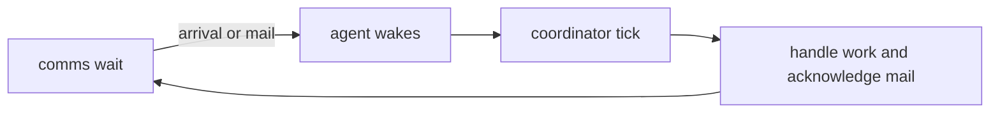

# Architecture

cones is one binary: a dashboard over native agent sessions, a job supervisor and a run ledger.
[Dashboard](dashboard.md), [configuration](jobs.md), [harness support](harness.md) and
[harness definitions](harness-definitions.md) describe each area's behavior.

## The boundary

| cones owns | The harness owns |
| --- | --- |
| Scheduling and `timeout_min` | Execution and permissions |
| Supervision, ledger and captured output | Native session identity and reports |
| Discovery, display and navigation | Native session operations |

cones never intercepts tool calls or adds a permission engine. A policy guarantee the
harness cannot enforce is a validation error. State, context and usage come from native
reports; missing values stay absent. Cost estimates carry their source and coverage.

## Components

## Runs and the ledger

Saving a job installs its launchd schedule. A tick invokes `cones run`; `cones catchup`
handles eligible missed schedules at login. The supervisor admits the run under the job's
overlap policy and starts a worker in a separate process group. The worker launches the
native background session and observes its reported result.

The ledger retains the run's identity, policy, outcome and usage, with captured output
stored separately. Timeout, stop and replacement end the native session and worker group.
Resuming a conversation keeps the original ledger outcome; its live session remains
associated with the run row. See the [run lifecycle](jobs.md#run-lifecycle).

## Harness definitions

Embedded `assets/harnesses/*.yaml` files declare paths, reports, native arguments and viewer
policies. `harness/spec.rs` validates and compiles them. Registered native adapters interpret
protocols and authorize supported operations; a YAML declaration cannot create support.
See the [schema and integration requirements](harness-definitions.md).

## Discovery

Readers use native registries, processes, writer locks, transcripts and databases. Identity
is scoped by harness and native home. A process without a known conversation keeps a process
identity; missing conversation fields stay absent. Codex daemon threads remain one session
even when their clients change. See [sources and attribution](harness.md#discovery).

## Observation cost

Each background refresh shares one process-table read and one read of each native index
among its consumers. `observe.rs` accounts for this work within the observation thread.
Caches invalidate against their source: Codex index/database/WAL changes, or a folder's
`.git` entry and a one-minute repository-layout lifetime. Branches are read from `HEAD`.
Liveness is checked against the kernel before signaling a process.

Native SQLite reads are in process and read-only, with no migrations or transaction held
across refreshes. Failed reads remain errors and are shared within the pass. Debug
`timing.summary` records process counts and per-operation observation costs. These diagnostics
place no limit on agent execution. [Resource checks](testing.md#resource-and-native-checks)
cover refresh and lifecycle costs.

## The dashboard

`tui.rs` owns the shared application state and screens. `viewer.rs` renders native clients
from private PTYs through the terminal emulator. `terminal_host.rs` retains owned interactive
terminals across dashboard closure; attachable daemon sessions keep their native ownership.
See [viewer controls](dashboard.md#viewer) and [ownership limits](harness.md#native-actions).

Historical previews use cones' transcript readers and `tui-markdown` for Ratatui text. This
keeps message selection, paging and navigation in process without a second viewer or session
catalog. Harness-specific styling remains cones code; previews do not reproduce native
extensions or interactive widgets.

History, context inspection, cost accounting, attention and fork links read native records
or cones metadata. Search caches text and passage embeddings in SQLite and runs local
inference on a separate worker, outside drawing and the test suite.

## The coordinator

The optional [coordinator skill](../assets/coordinator/skills/start-coordinator/SKILL.md)
handles overlaps, relevant findings and integration in one folder. The launcher embeds the
skill as a plugin and starts a background Claude session. The role and its command plumbing
are harness-neutral; task scope remains with the owner and workers.

`src/coordinator.rs` owns claims, the roster, delivery and inbox state. The skill supplies
judgment. [CLI commands](cli.md#coordinator) expose the same mechanisms to a dispatcher
without requiring a coordinator session. Commands make no model calls; waking an agent or
delivering a note can cause a native model turn.

### The wake loop

An unscoped `wait` wakes for a new roster session or inbox mail. Departures, state changes
and tree edits are read by `tick` once awake. Its first arm establishes a roster baseline
but still returns unacknowledged mail. Each event batch is announced once.

With `--id`, the watch follows named workers and reports native input requests, failures
or departures once per condition, plus mail. These events are reasons to inspect the worker;
completion comes from its result report. `--timeout` bounds the caller's wait and never stops
a worker. Quiet output does not establish completion or failure.

Reading mail leaves it pending; `mail --ack N` marks it handled. A fresh claim skips mail
predating it; replacing a coordinator restores mail the previous holder read without
acknowledging. One live claim holder consumes a folder's inbox, and only one watcher may be
armed. Other agents may still send into it.

### Roster and messaging

The coordinator uses `cones ls --dir --json` and the same native discovery as the dashboard.
Delivery requires the recipient harness's `message` operation; cones never substitutes
terminal typing. Codex delivery uses the daemon belonging to the recipient's native home.
A greeting is recorded once per session. Delivery does not establish that a worker read or
answered it. Notes identify their sender and carry only the authority the owner granted.

### Coordinator state

State lives under `STATE_DIR/coordinator/folders/<sha256 of absolute folder>` so replies
outlive the requesting session. `folder.lock` protects claim and watcher changes;
per-process temporary files make record replacement atomic. The claim identifies a native
session and folder, with a refreshed PID for liveness. Titles do not identify the role.
See the [state files](cli.md#state).

### Integration

Workers hand over checked commits. The coordinator integrates them in order, checks the
combined tree and advances the base only if it has not changed. Shared-tree changes must be
staged from a diff containing only the intended hunks. Scope, configuration and publication
remain owner decisions; the skill and repository instructions govern the workflow.
