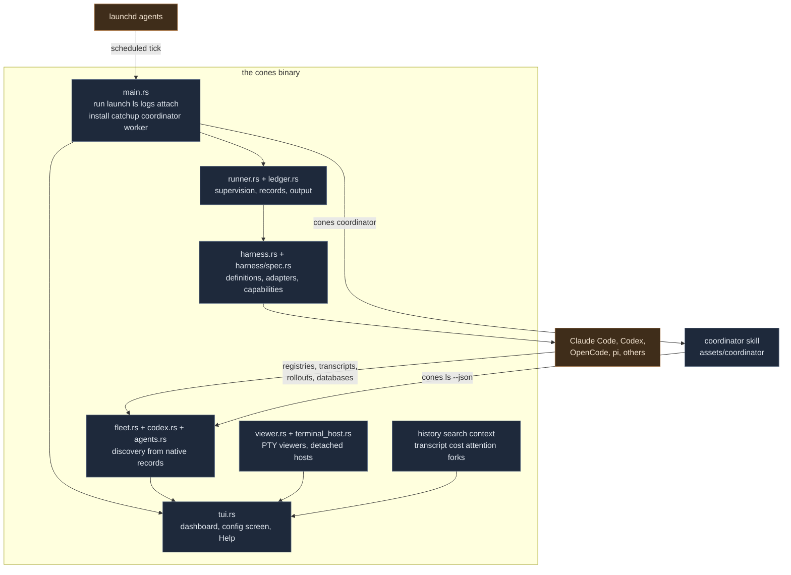
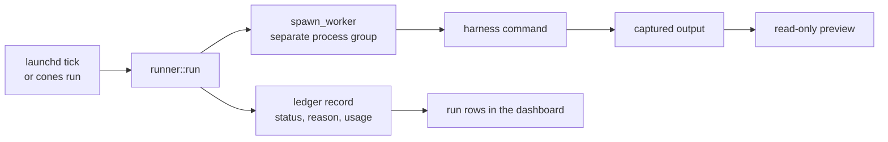
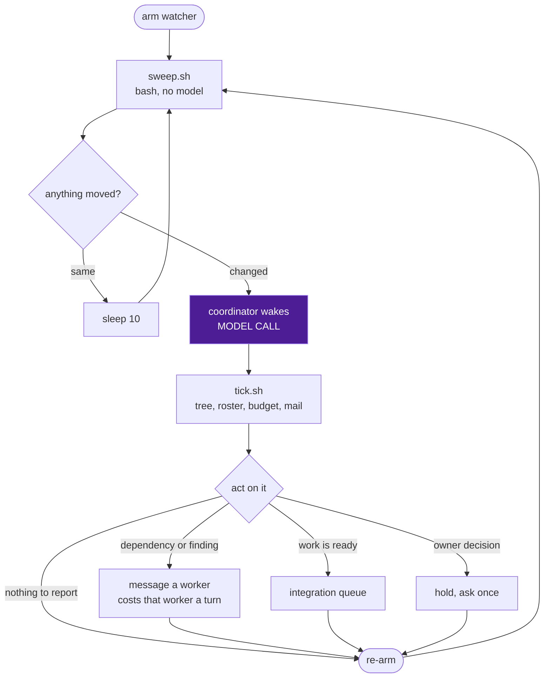
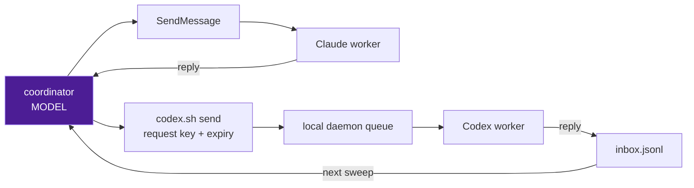

# Architecture

cones is one binary. It schedules and supervises agent runs, keeps the ledger those runs write,
and draws a dashboard over every agent session on the machine. It never executes an agent's tools
and never decides an agent's permissions: that belongs to the harness, and the boundary is the
single most load-bearing rule in the codebase.

This document is the map. Per-area detail lives in [dashboard.md](dashboard.md),
[jobs.md](jobs.md), [harness.md](harness.md) and [harness-definitions.md](harness-definitions.md).

## The boundary

| cones owns | The harness owns |
| --- | --- |
| Scheduling and catch-up | Running the agent |
| Supervision and `timeout_min` | Tool calls and permissions |
| The ledger and captured output | Session identity and state |
| Discovery, drawing, navigation | Stopping, removing, renaming |

`timeout_min` is the only limit cones puts on a run. cones never intercepts a harness tool call
and never adds a second permission engine. A policy the harness cannot enforce natively is a
validation error rather than a best effort, because a guarantee cones cannot keep is worse than
a refusal the user can see.

Reported facts are read, never estimated. State, context window and usage come from what the
harness itself reports; a value it never reported stays absent rather than inferred.

## Components

Everything in the dark box is this binary. The harness and launchd are outside it, and the arrows
crossing that line are the whole integration surface.

## Runs and the ledger

A job is the agent you would run by hand, on a schedule: your settings, your MCP servers, no
permission prompts, and a timeout. `jobs.yaml` holds them, `cones install` writes the LaunchAgents,
and a tick runs `cones run`. `cones catchup` covers ticks that passed while the Mac was off.

The worker runs in its own process group so a supervised run outlives the process that started it
and can be stopped as a unit. The ledger keeps the record, the captured output and the reason,
which is what a run row shows long after its agent is gone. A resumed run keeps its place in the
run list: the session the harness reports for it belongs to that row, not to a new agent.

## Harness definitions

`assets/harnesses/*.yaml` declares each harness: where it keeps sessions, what it reports, and
which operations it supports. `harness/spec.rs` validates a definition and compiles the values its
consumers use, so unknown fields, inconsistent capabilities and invalid command operands are
errors rather than surprises at runtime.

An operation needs a native adapter behind it. Declaring `rename: true` means the harness has a
native rename cones can hand off to; only the compiled Claude execution adapter can authorize a
supervised run. Unverified support is named `unknown` rather than assumed.

## Discovery

The fleet is built from records the harnesses own: Claude's session registry and transcripts,
Codex's processes, writer locks, thread database and rollouts, OpenCode's SQLite storage. cones
reads them and reports one state per session. It starts no client to ask.

A process is not a conversation. A harness launched into a terminal with no archive adapter gives
a row with a folder and a title, and its identity, state and accounting stay absent rather than
guessed. A Codex agent is its thread rather than its pid, so a client restart is not an exit.

## The dashboard

`tui.rs` draws sessions, runs, jobs and history as rows, with a preview pane beside them. It is
one file because its `App` holds the shared state every screen reads; a split into per-screen
modules was tried and folded back.

Viewers are PTY-backed and rendered through vt100 into the pane, so viewer output never reaches
the real terminal directly. A live pane is the native client, not an emulation of one, which is
why controls in a pane follow the harness's own capabilities. Historical rows get read-only
transcript previews instead. `terminal_host.rs` keeps one detached PTY owner per interactive
terminal, so work survives the dashboard closing; it runs no agent tools and makes no permission
decisions.

The read-only side of the dashboard is deliberately large: history, search, context inspection,
cost provenance, attention markers and fork parentage are all observers over native records.
Search keeps text and cached passage embeddings in SQLite and runs inference on a separate worker,
so neither a draw nor a test starts a model.

## The coordinator

The coordinator is a Claude Code session running the `start-orchestrator` skill, which ships in
this repository under `assets/coordinator`. `cones coordinator` writes the plugin out of the
binary, with the helper path substituted in, and starts one background session for a folder. The
skill and its helpers are native to cones: they are compiled in with `include_str!`, their Python
suite is in `assets/coordinator/tests`, and the full gate runs it.

It schedules nothing and executes nothing. It reads who is working in a folder, carries facts
between those workers, and lands their finished changes.

### Where the model calls are

Three places, and only three.

1. The coordinator wakes. One call per wake, whatever caused it.
2. A worker receives a message. A note costs the recipient a turn, so a message it did not need
   is a real cost charged to someone else's budget.
3. A worker does its own work, which is the point and not the coordinator's concern.

The sweep loop, the roster read, the mail check, the delivery helper and the validation gate are
plain processes. This is why the wake gate is the most load-bearing piece of the design: a gate
that fires when nothing happened turns a ten second sleep into a model call every ten seconds.

### The wake loop

`sweep.sh` reports four kinds of movement: a roster delta from `cones ls`, unacknowledged mail
that has not been shown yet, a change in the delivery helper's error, and a change in the roster
read's error. Errors are reported on the edge, once, so a persistent failure does not wake the
coordinator repeatedly.

The mail gate needs both halves of its condition. `inbox.ack` is what the coordinator durably
handled and only `codex.sh ack` moves it. `inbox.shown` is the watcher's own note of what it
already put in front of the model, so one pending batch wakes it once rather than every pass. A
fresh job starts without `inbox.shown`, so gating on that file alone treats an inbox's entire
acknowledged history as new on every pass, forever. The test is
`the_coordinator_watcher_wakes_for_unacknowledged_mail_and_stays_quiet_otherwise` in
`tests/core.rs`.

### Roster and messaging

The roster is one read of `cones ls --dir --json`, covering the folder and the worktrees under it.
cones decides who is a worker: it drops unclaimed spares, resolves a Codex thread to its client,
ignores viewer and daemon processes, and turns each harness's own report into one state. The
coordinator does not re-derive any of that, because a second implementation of discovery drifts
from the first and the disagreement surfaces as a worker that exists in one view and not the
other. A read that fails keeps the previous roster and reports the failure once.

Two transports, because the harnesses differ.

A Claude reply arrives in the coordinator's conversation and costs it a turn immediately. A Codex
reply lands in the folder's inbox and costs nothing until the next wake. Delivery is not reading:
a message can reach a session whose agent never answers, which is why the greeting asks for an
acknowledgement. Without one, a worker that read the greeting and a worker that never received it
look identical.

Every Codex request carries its own `reply_to`, so two open requests to one task come back
distinguishable, and reusing a key is idempotent so a replayed reply cannot produce a second
follow-up.

The Codex transport needs Python 3 and a running local Codex app-server with `thread/read` and
`thread/queue` add, list and delete support. It was verified against Codex 0.154.0, and the full
greet, request, reply, acknowledge, reset and finish cycle against a live 0.155.1 daemon and
client. `codex.sh` discovers the daemon's Unix WebSocket address with `codex app-server daemon
version` under the selected `CODEX_HOME`, and uses the native queue operations rather than
editing the database. Enqueueing a request can cause the harness to resume the worker, and an
unknown recipient is refused rather than guessed.

A session, a task and a request have separate lifetimes. A greeting introduces the coordinator to
the session once and is never repeated, so finishing a task cannot suppress the message that asks
the worker to report its next assignment. A reachable thread registers a task whether it is
active or idle, and only a thread that has ended is refused.

### Coordinator state

| File | Lives in | Survives the job |
| --- | --- | --- |
| Status record | `<claude dir>/orchestrator/<sha1>.json` | yes |
| `inbox.jsonl` | the folder's coordinator dir | yes |
| `inbox.ack` | beside the inbox | yes |
| `inbox.shown` | this job's working dir | no |
| `roster.prev` | this job's working dir | no |
| `integration.json` | this job's working dir | no |

A reply must outlive the job that received it, so the inbox and the acknowledged position sit in
the folder's own directory and a replacement coordinator sees anything still pending. The
watcher's note of what it already displayed is per job, because a new job has not displayed
anything.

The status record holds the pid and folder cones matches to mark a session the coordinator, under
`CLAUDE_CONFIG_DIR` when that is set, the same home the roster read resolves. It is written
through a per-process temporary: two coordinators write this record legitimately, a replacement
overlapping the one it takes over from among them, and one shared temporary name means the second
writer's rename deletes the first writer's source. The writer that loses dies and takes its
watcher with it. The test is
`concurrent_coordinators_can_write_the_status_record_without_destroying_each_other`.

### Integration

Workers commit on the base they checked and hand over the hash. The coordinator keeps one ordered
queue, reads the diff and the author's checks, rebases in a clean checkout, runs the required
checks on the combined tree, and advances main only while it still has the expected base. A clean
rebase does not prove the combined result passed, which is why the check runs after the rebase.

On a shared checkout the coordinator never stashes and never resets. Staging by path commits every
author's hunks in a file, so a commit comes from a diff trimmed to one author's hunks.

## Who enforces what

| Guarantee | Enforced by |
| --- | --- |
| A job's policy is one the harness can keep | `harness/spec.rs` validation |
| A run stops at its limit | `runner.rs` and `timeout_min` |
| What a run did | the ledger record and captured output |
| Permissions and execution | the harness |
| Who counts as a worker | `cones ls` |
| One coordinator per folder | the status record's live pid |
| A coordinator wake means something moved | `sweep.sh` |
| Mail is handled, not just read | `codex.sh ack` |
| A combined tree is sound | `scripts/check` |
| Scope, config, pushing | the owner |
