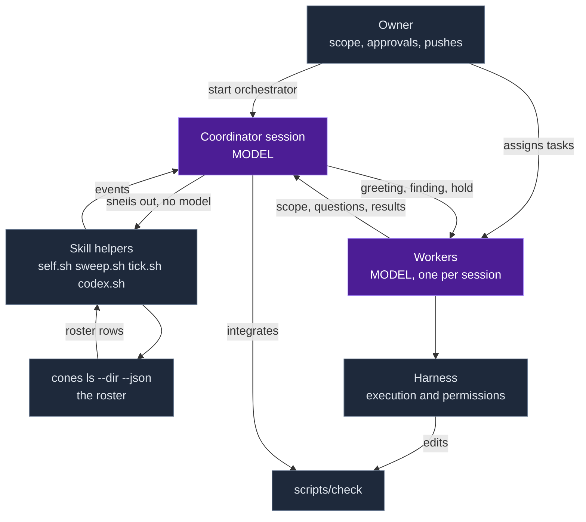
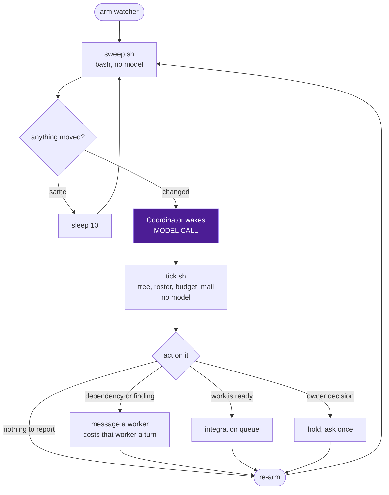
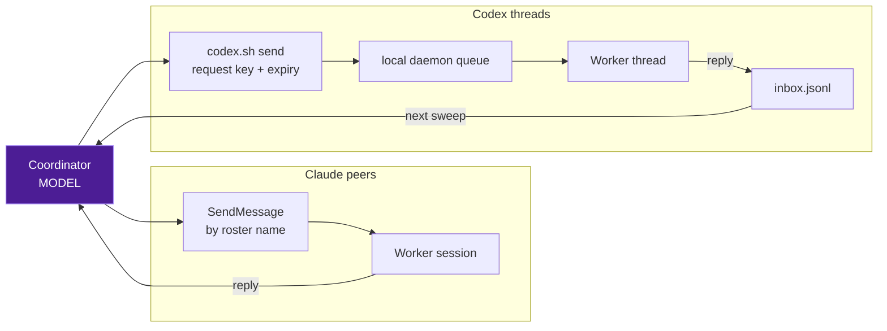

# Coordinator architecture

The coordinator is a Claude Code session running the `start-orchestrator` skill. It schedules
nothing and executes nothing. It reads who is working in a folder, carries facts between those
workers, and lands their finished changes. Everything it knows comes from cones, and everything
it does to a worker goes through that worker's own harness.

This document covers the coordinator only. For the supervisor that runs jobs, see
[jobs.md](jobs.md); for what each harness reports, see [harness.md](harness.md).

## Components

| Component | Runs | Owns |
| --- | --- | --- |
| Coordinator session | Claude Code | Decisions, messages, integration |
| Skill helpers | bash, python | Roster diffing, delivery, wake gating |
| `cones ls --dir --json` | Rust binary | Who is a worker, and their state |
| Harness | Claude Code, Codex | Execution, permissions, the edits |
| `scripts/check` | cargo | Whether a combined tree is sound |

The split matters because only one of these costs money. The coordinator session is a model. The
helpers, the roster read and the check are ordinary processes. A design that moves work out of the
session and into a helper makes the coordinator cheaper without making it dumber.

## Where the model calls are

Three places, and only three.

1. The coordinator wakes. One call per wake, whatever caused it.
2. A worker receives a message. A note costs the recipient a turn, so a message it did not need
   is a real cost charged to someone else's budget.
3. A worker does its own work, which is the point and not the coordinator's concern.

Nothing else spends a model. The sweep loop, the roster read, the mail check, the delivery
helper and the validation gate are all plain processes. The `tick.sh` read that starts a wake is
free; what costs is the wake itself.

This is why the wake gate is the most load-bearing piece of the design. A gate that fires when
nothing happened turns a ten second sleep into a model call every ten seconds.

## The wake loop

The watcher is a shell loop, armed once as a background command. It calls `sweep.sh`, which
prints `same` or `changed` followed by the sections that moved. While the answer is `same` the
loop sleeps and calls again. No model is involved until the loop exits.

`sweep.sh` reports four kinds of movement: a roster delta from `cones ls`, unacknowledged mail
that has not been shown yet, a change in the delivery helper's error, and a change in the roster
read's error. Errors are reported on the edge, once, so a persistent failure does not wake the
coordinator repeatedly.

The mail gate needs both halves of its condition. `inbox.ack` is what the coordinator durably
handled and only `codex.sh ack` moves it. `inbox.shown` is the watcher's own note of what it
already put in front of the model, so one pending batch wakes it once rather than every pass. A
fresh job starts without `inbox.shown`, so gating on that file alone treats an inbox's entire
acknowledged history as new on every pass, forever. The test for this is
`the_coordinator_watcher_wakes_for_unacknowledged_mail_and_stays_quiet_otherwise` in
`tests/core.rs`.

## Who enforces what

| Guarantee | Enforced by |
| --- | --- |
| Who counts as a worker | `cones ls` |
| Permissions and execution | the harness |
| One coordinator per folder | the status record's live pid |
| A wake means something moved | `sweep.sh` |
| A request is not sent twice | `codex.py` request keys |
| Mail is handled, not just read | `codex.sh ack` |
| A combined tree is sound | `scripts/check` |
| Scope, config, pushing | the owner |

The coordinator enforces none of these itself. It has no permission engine and never intercepts
a harness tool call. When it wants a worker to stop, it asks, and the worker's harness decides
what that worker is allowed to do. A coordinator that tried to enforce a policy the harness
cannot enforce natively would be lying about a guarantee it cannot keep.

## Discovery

The roster is one read of `cones ls --dir --json`, covering the folder and the worktrees under
it. cones decides who is a worker: it drops unclaimed spares, resolves a Codex thread to its
client, ignores viewer and daemon processes, and turns each harness's own report into one state.

The coordinator does not re-derive any of that. It does not read the session registries, scan
rollouts or walk the process table, because a second implementation of discovery drifts from the
first and the disagreement surfaces as a worker that exists in one view and not the other. A read
that fails keeps the previous roster and reports the failure once. An install without `cones ls`
fails here too, which makes this the version check.

A reported state is what the harness said, not an inference. `blocked` may mean the worker is
waiting on the owner rather than on the coordinator. Idle and exit are not completion signals;
completion is a worker's own report or a landed result.

## Messaging

Two transports, because the harnesses differ.

A Claude reply arrives in the coordinator's conversation and costs it a turn immediately. A Codex
reply lands in the folder's inbox and costs nothing until the next wake. Delivery is not reading:
a message can reach a session whose agent never answers. That is why the greeting asks for an
acknowledgement. Without one, a worker that read the greeting and a worker that never received it
look identical.

Every Codex request carries its own `reply_to`, so two open requests to one task come back
distinguishable, and reusing a key is idempotent so a replayed reply cannot produce a second
follow-up.

## State

| File | Lives in | Survives the job |
| --- | --- | --- |
| Status record | `~/.claude/orchestrator/<sha1>.json` | yes |
| `inbox.jsonl` | the folder's coordinator dir | yes |
| `inbox.ack` | beside the inbox | yes |
| `inbox.shown` | this job's working dir | no |
| `roster.prev` | this job's working dir | no |
| `integration.json` | this job's working dir | no |

The split is deliberate. A reply must outlive the job that received it, so the inbox and the
acknowledged position sit in the folder's own directory and a replacement coordinator sees
anything still pending. The watcher's note of what it already displayed is per job, because a new
job has not displayed anything.

The status record holds the pid and folder that cones matches to mark a session the coordinator.
A live pid in that record means another coordinator owns the folder. It is written under
`CLAUDE_CONFIG_DIR` when that is set, the same home the roster read resolves, and through a
per-process temporary file. Two coordinators write this record legitimately, a replacement
overlapping the one it takes over from and a watcher left armed from an earlier arm, and one
shared temporary name means the second writer's rename deletes the first writer's source. The
writer that loses dies, and it takes its watcher down with it. The test is
`concurrent_coordinators_can_write_the_status_record_without_destroying_each_other`.

## Integration

Workers commit on the base they checked and hand over the hash. The coordinator keeps one ordered
queue, reads the diff and the author's checks, rebases in a clean checkout, runs the project's
required checks on the combined tree, and advances main only while it still has the expected base.

A clean rebase does not prove the combined result passed, which is why the check runs after the
rebase and not before it. Work goes back to its author only when a conflict or a failed check
requires revising that contribution.

On a shared checkout the coordinator never stashes and never resets. Staging by path commits
every author's hunks in a file, so a commit comes from a diff trimmed to one author's hunks, with
the staged hunk headers compared against what that author reported.
